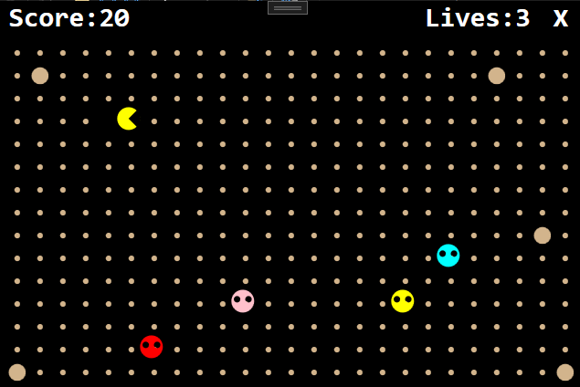
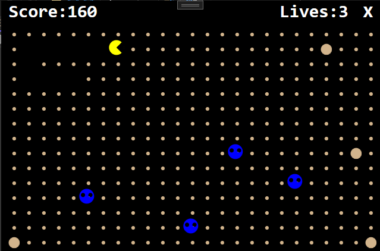
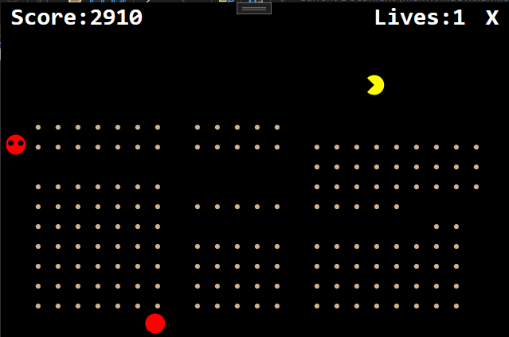

A game similar to the famous Pacman arcade game where the goal is to get the highest score possible by eating fruit and avoiding ghosts. The player moves with the up, down, left, and right arrows on the keyboard.

If the player eats the larger circles, the ghosts will turn blue for a short time and Pacman will be able to eat them just like fruit to gain points.

After a certain amount of fruit has been eaten, a large red 'cherry' fruit will spawn. This fruit is worth more points than any other fruit, and will net a lot of points if eaten!

The player has 3 lives. If all 3 lives are lost, the player loses. Press 

Created with .NET Microsoft WPF (Windows Presentation Format).
